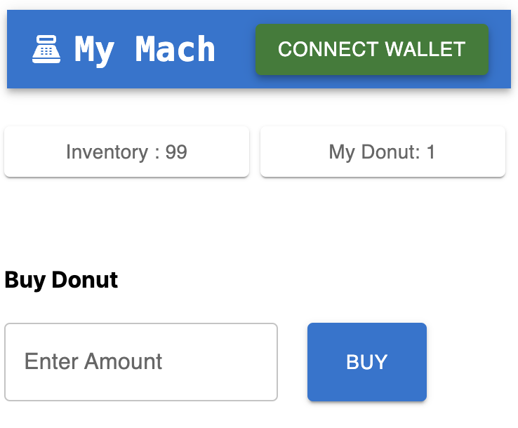

# Vending Machine

- This is a fundamental decentralized application named vending machine with 3 main features: connecting wallet, buying donut by the use of your wallet and accessing data from blockchain, mainly used as technical demonstration or consulting facility about blockchain development.

- Currently, latest Sepolia test network is used after removing goerli and rinkeby due to their deprecation in the market.

- To understand contracts from the smart contract directory, some of `Solidity` programming knowledge would be necessary.

- `Truffle` is used for contract deployment.

- `Next.js` and `MaterialUI` is used for frontend part.

- `Alchemy` and `MetaMask` are used for node provider and wallet (`Infura` was used initially but chose alchemy for better reliability )

- You can mine some SepoliaETH at this [link](polia-faucet.pk910.de) for development purpose.

- `Web3.js` is used to interact with ethereum blockchain.

This is the app screenshot for the moment.

